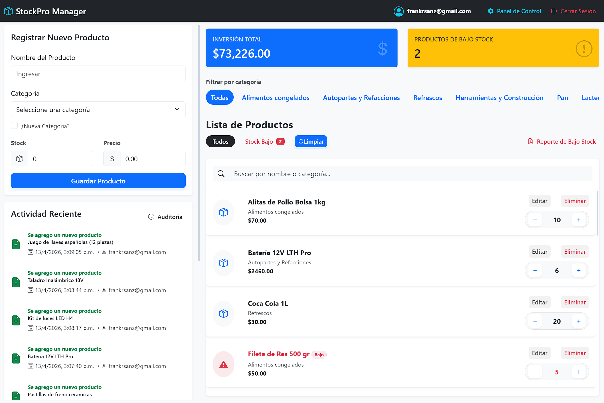
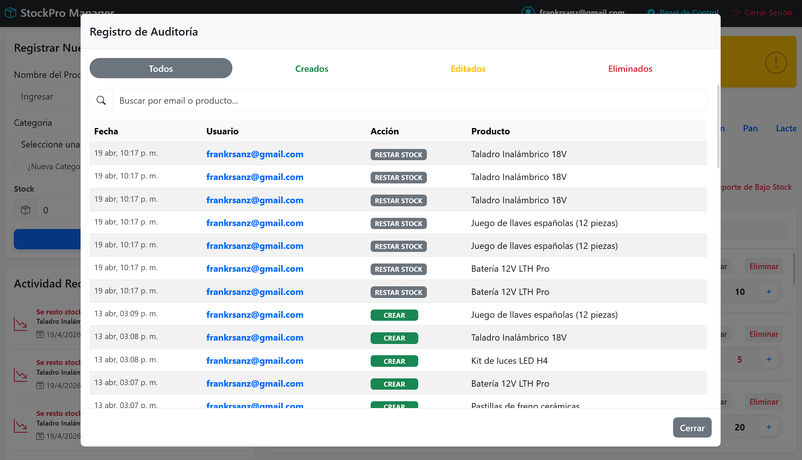

# Stockpro Manager - Sistema de Inventario

Stockpro Manager es mi **Proyecto Fundacional**. Fue construido deliberadamente utilizando **Vanilla JavaScript (sin frameworks)** con el objetivo de dominar los fundamentos de la web: manipulación directa del DOM, manejo de estado nativo y consumo asíncrono de APIs antes de transicionar a librerías modernas como React.

**[Visita el proyecto en vivo aquí](https://stockpromanagerv1.netlify.app/login.html)** ---

## Propósito del proyecto

En la era de los frameworks mágicos, decidí construir esta aplicación desde cero para entender "qué pasa por debajo". Este proyecto demuestra mi capacidad para:
1. Construir un sistema de enrutamiento y protección de rutas (Auth Guards) a mano.
2. Manejar el estado global de la aplicación mutando el DOM de forma eficiente.
3. Integrar bases de datos en tiempo real (Supabase) con WebSockets.

---

## Interfaz del Sistema

| Panel de Control | Auditoría y Logs |
| :---: | :---: |
|  |  |
| *Gestión de inventario con filtros dinámicos.* | *Registro inmutable de actividad y control de usuarios.* |

---

## Características Principales

* **Sistema de Autenticación y Roles:** Login seguro y protección de rutas. Diferenciación de vistas entre `Admin` y `Vendedor`.
* **Sincronización en Tiempo Real:** Los cambios en el inventario se reflejan instantáneamente en todos los dispositivos conectados gracias a Supabase Channels (WebSockets).
* **Dashboard Dinámico:** Cálculo en tiempo real del valor total del inventario y alertas de stock bajo.
* **Generación de Reportes PDF:** Creación de reportes descargables directamente desde el navegador usando `jsPDF`.
* **Logs de Auditoría:** Registro inmutable de cada acción (creación, edición, eliminación, movimiento de stock) para control del administrador.

---

## Stack Tecnológico

**Frontend:**
* **JavaScript (ES6+):** Lógica de negocio, manipulación del DOM y manejo de estado.
* **HTML5 & CSS3:** Estructura semántica.
* **Bootstrap 5:** Sistema de grillas y componentes UI responsivos.
* **SweetAlert2 & jsPDF:** Librerías para notificaciones interactivas y exportación de documentos.

**Backend as a Service (BaaS):**
* **Supabase:** Autenticación de usuarios, Base de Datos PostgreSQL y suscripciones Realtime.

---
Construido desde los cimientos por **[@darthsanz](https://github.com/darthsanz)**.